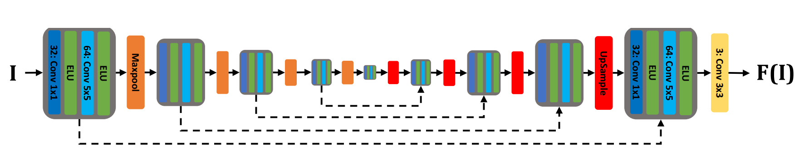

# Self-Supervised Unconstrained Illumination Invariant Representation

This repository contains the code which implements the InvRepNet network and the training, test and inference scripts of this model.
Presented in our [paper](https://arxiv.org/abs/1911.12641) "Self-Supervised Unconstrained Illumination Invariant Representation". The paper supplementary material is available [here](https://drive.google.com/file/u/6/d/1FLnPCfHz__AYkm_WtUwXqPHGq-dmCnzQ/view?usp=drive_open).

## Running InvRepNet:
#### Requirements:
The code is implemented in PyTorch 1.2.0 running on Python 3.7.2.
\
All the packages needed can be installed using:
```bash
pip install -r requirements.txt
```

#### Download the training and test data:
Our training and test datasets are composed of scenes from the [BigTime dataset](http://www.cs.cornell.edu/projects/bigtime/) and from  [Middlebury 2014 stereo dataset](http://vision.middlebury.edu/stereo/data/scenes2014/).
The training set is a subset of scenes and a list patch triplets. The test set is a subset of image pairs.
They can be downloaded from this [link](https://drive.google.com/open?id=1neK9SxoZ-PDkrvBAqy0iolyTWPpPH_Ch).
After downloading extract the zip file into the data directory.

#### Training:
Training with default parameters (as defined in [arguments.py](arguments.py)):
```bash
python train.py /path/to/the/training/data/
```
Adjustable training parameters can be seen with:
```bash
python train.py --help
```

#### Test:
Patch matching:
 ```bash
python test_patchmatching.py /path/to/the/test/data/ --pretrained_model /path/to/the/pretrained/model/
```
Registration:
```bash
python test_registration.py /path/to/the/test/data/ --pretrained_model /path/to/the/pretrained/model/
```

#### Inference:
For running InvRepNet on a directory of images:
```bash
python inference.py /path/to/the/input/images/dir/ --pretrained_model /path/to/the/pretrained/model/ --output --/path/to/the/output/images/dir/
```

## Model:
The training model is based on triplet network with a triplet loss. The inference is done using a single image.


## Architechture:
InvRepNet is based on the encoder-decoder U-Net architecture.



## Results:


## Citation:
If you find our work useful in your research, please cite our paper:
```bash
@article{kaliroff2019self,
  title={Self-Supervised Unconstrained Illumination Invariant Representation},
  author={Kaliroff, Damian and Gilboa, Guy},
  journal={arXiv preprint arXiv:1911.12641},
  year={2019}
}
```

## Acknowledgements:
We thank [Kenneth Vanhoey](https://github.com/kvanhoey/UnsupervisedIntrinsicDecomposition), 
[Clement Pinard](https://github.com/ClementPinard/SfmLearner-Pytorch) and 
[Jackson Huang](https://github.com/jaxony/unet-pytorch) 
for their repos used for inspiration in our code.

